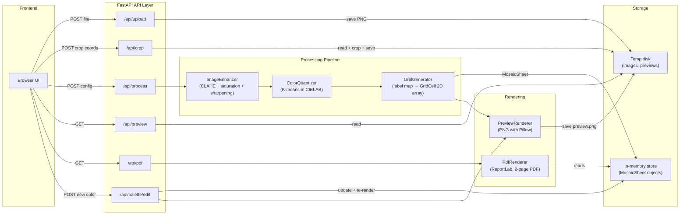

# Architecture

## System Overview

The Mosaic Coloring App is a single-server web application. A FastAPI backend serves both the REST API and a static frontend. Images are processed through a four-stage pipeline (enhance → quantize → grid → render) and stored temporarily on disk. There is no database — mosaic state lives in an in-memory `OrderedDict` with LRU eviction.

## Pipeline Data Flow

## Component Descriptions

### API Layer (`src/api/`)

**`routes.py`** — All HTTP endpoints. Handles file upload validation (magic bytes, size limits), image storage/retrieval, crop execution, pipeline orchestration, and palette editing. CPU-heavy work runs via `asyncio.to_thread` to avoid blocking the event loop. Contains an `OrderedDict`-based in-memory store for `MosaicSheet` objects (max 100 entries, LRU eviction).

**`schemas.py`** — Pydantic models for all request/response payloads. Defines `MosaicMode` enum (`square`, `circle`, `hexagon`), validates hex color strings, and enforces bounds on `num_colors` (8–20) and `size` (3–5).

### Models (`src/models/`)

**`mosaic.py`** — Core domain objects:
- `ColorPalette` — Wraps an Nx3 NumPy array of RGB values. Provides `label(index)` and `hex_color(index)` accessors. Labels use characters `0–9, A–J` (max 20 colors).
- `GridCell` — A single cell: row, column, color index, and label character.
- `MosaicSheet` — Complete mosaic: grid (2D list of `GridCell`), palette, dimensions, component size, and mode.

### Processing Pipeline (`src/processing/`)

**`enhancement.py`** — `ImageEnhancer` applies three sequential transformations:
1. CLAHE contrast enhancement on the L channel (LAB space)
2. Saturation curve boost in HSV space
3. Edge-aware sharpening via bilateral filter + unsharp mask

**`quantization.py`** — `ColorQuantizer` converts the image to CIELAB, runs scikit-learn K-means clustering, and produces a 2D label map plus a `ColorPalette` of cluster centers converted back to RGB.

**`grid.py`** — `GridGenerator` downsamples the label map into a fixed-size grid. Each cell is assigned the most frequent color index in its corresponding region (via `np.bincount`).

### Rendering (`src/rendering/`)

**`preview.py`** — `PreviewRenderer` generates a PNG preview image using Pillow's `ImageDraw`. Supports square, circle, and hexagon cell shapes. Each cell is filled with its palette color and labeled with a contrast-adjusted character.

**`pdf.py`** — `PdfRenderer` generates a two-page US Letter PDF via ReportLab:
- Page 1: The mosaic grid (numbered cells in the chosen shape)
- Page 2: Color legend (swatches + labels + hex codes)

**`geometry.py`** — `hex_vertices()` computes the 6 vertices of a pointy-top regular hexagon given center coordinates and circumradius.

**`color_utils.py`** — `perceived_brightness()` implements the ITU-R BT.601 luminance formula, used to choose black or white label text for contrast.

### Frontend (`static/`)

A single-page app with no build step. Four UI steps (upload → crop → configure → preview/download) are shown sequentially by toggling `hidden` attributes. Uses Cropper.js (loaded from CDN) for interactive image cropping. Palette swatches are clickable color pickers that call the palette edit API with debouncing.

### Configuration (`src/config.py`)

All tunable parameters — upload limits, grid dimensions, paper size, temp storage — are defined as module-level constants. Integer settings can be overridden via environment variables. A `validate_config()` function runs at startup to catch misconfiguration early.

## Key Design Decisions

| Decision | Rationale |
|----------|-----------|
| In-memory mosaic store (no database) | Simplicity for Phase 1; LRU eviction keeps memory bounded |
| K-means in CIELAB space | Produces perceptually uniform color clusters vs. RGB |
| CPU work via `asyncio.to_thread` | Keeps the FastAPI event loop responsive during image processing |
| Magic-byte validation before `PIL.Image.open` | Prevents processing of disguised file types |
| Grid dimension lookup table | Precomputed (size, mode) → (cols, rows) avoids runtime math errors |
| Single-character labels (0–9, A–J) | Fits in small grid cells; caps colors at 20 |
| No build step for frontend | Reduces toolchain complexity; CDN-loaded Cropper.js only external dependency |

## External Dependencies

| Package | Role |
|---------|------|
| **FastAPI + Uvicorn** | HTTP framework and ASGI server |
| **Pillow** | Image loading, RGBA→RGB conversion, preview rendering |
| **OpenCV (headless)** | Color space conversions (LAB, HSV), CLAHE, bilateral filter |
| **scikit-learn** | K-means clustering for color quantization |
| **NumPy** | Array operations throughout the pipeline |
| **ReportLab** | PDF generation with precise positioning |
| **python-multipart** | File upload parsing for FastAPI |
| **Cropper.js** (CDN) | Frontend image cropping widget |
